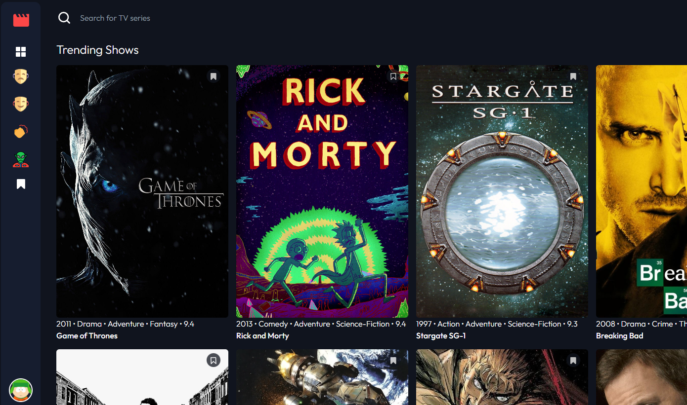

# Entertainment web app

## Table of contents

- [Overview](#overview)
  - [The challenge](#the-challenge)
  - [Screenshot](#screenshot)
  - [Links](#links)
- [My process](#my-process)
  - [Built with](#built-with)
  - [What I learned](#what-i-learned)
  - [Continued development](#continued-development)
- [Author](#author)

## Overview

### The challenge

Users should be able to:

- View the optimal layout for the app depending on their device's screen size
- See hover states for all interactive elements on the page
- Navigate between Home, Genres, and Bookmarked Shows pages
- Add/Remove bookmarks from all movies and TV series
- Search for relevant shows on all pages
- **Bonus**: Build this project as a full-stack application

### Screenshot

### Links

- Live URL: [Heroku Live App](https://entertainment-web-app-lowlyphe.herokuapp.com/)

## My process

### Built with

- Semantic HTML5 markup
- CSS3
- Mobile-first workflow
- [Tailwind](https://tailwindcss.com/) - JS library
- [Express](https://expressjs.com/) - Node library
- [PostgreSQL](https://www.postgresql.org/) - Database

### What I learned

This is my first fullstack app and took some time to work out the kinks. I used this project to practce using tailwind for the front end and playing with express for the back end. I had to do a bit of research to get the search functionality to work, ended up going with psql full text search.

### Continued development

I would like to improve the database search functionality by incorporating psql trigrams to include some search fuzziness. I would also like to learn more about auth flow and implement it into the project.

## Author

- Frontend Mentor - [@lowlyphe](https://www.frontendmentor.io/profile/lowlyphe)
